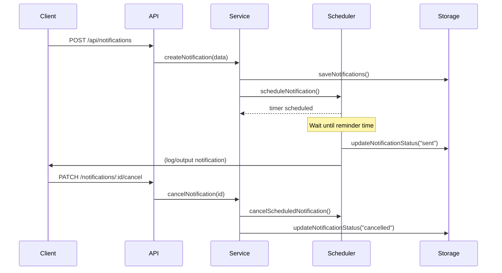

# StarbreakerNotifications Microservice

## Description
A notification service for applications that manages assignment reminders for users.  
This microservice allows clients to create, retrieve, schedule, and cancel notifications using a REST API built with Node.js and Express.

Notifications are stored persistently in a JSON file and include scheduling logic to trigger reminders before assignment due dates. The service also updates notification states automatically (`pending → sent → cancelled`).

---

## Communication Contract
This microservice uses REST API over HTTP with JSON formatted requests and responses.

- **Protocol:** HTTP
- **Format:** JSON
- **Methods:** GET, POST, PATCH

---

## How to Request Data

### Create Notification

**POST** `/api/notifications`

#### Example (JavaScript)

```javascript
fetch("http://localhost:3001/api/notifications", {
    method: "POST",
    headers: {
        "Content-Type": "application/json"
    },
    body: JSON.stringify({
        userId: 1,
        assignmentName: "Database Project",
        dueDate: "2026-05-20T23:59:00",
        notificationTime: "24h",
        priorityLevel: "high"
    })
})
.then(res => res.json())
.then(data => console.log(data));
```

#### Example (cURL)

```bash
curl -X POST http://localhost:3001/api/notifications \
-H "Content-Type: application/json" \
-d '{"userId":1,"assignmentName":"Database Project","dueDate":"YYYY-MM-DDTHH:MM:SS","notificationTime":"24h","priorityLevel":"high"}'
```

```bash
TIMESTAMP=$(node -e "console.log(new Date(Date.now() + 20000).toISOString())") && \
curl -X POST http://localhost:3001/api/notifications \
-H "Content-Type: application/json" \
-d "{\"userId\":1,\"assignmentName\":\"Curl Test Reminder\",\"dueDate\":\"$TIMESTAMP\",\"notificationTime\":\"10s\",\"priorityLevel\":\"high\"}"
```

---

### Get Notifications (Filtering)

**GET** `/api/notifications?userId=1`

Optional query parameters:
- `status` → pending, sent, cancelled
- `priorityLevel` → high, normal

#### Example

```bash
curl "http://localhost:3001/api/notifications?userId=1&status=pending"
```

---

### Cancel Notification

**PATCH** `/api/notifications/:notificationId/cancel`

#### Example

```bash
curl -X PATCH http://localhost:3001/api/notifications/12345/cancel
```

---

## How to Receive Data

All responses are returned in JSON format.

---

### Successful Response (Create)

```json
{
  "status": "success",
  "message": "Notification saved successfully",
  "notification": {
    "id": 12345,
    "userId": 1,
    "assignmentName": "Database Project",
    "dueDate": "2026-05-20T23:59:00",
    "notificationTime": "24h",
    "priorityLevel": "high",
    "status": "pending",
    "createdAt": "2026-05-19T20:00:00Z"
  }
}
```

---

### Successful Response (Cancel)

```json
{
  "status": "success",
  "message": "Notification cancelled successfully",
  "result": {
    "notificationId": 12345,
    "status": "cancelled",
    "timerCancelled": true
  }
}
```

---

### Error Response

```json
{
  "status": "error",
  "message": "Notification not found"
}
```

---

## Notification Lifecycle

```
pending → sent  
pending → cancelled
```

- **pending:** Notification scheduled
- **sent:** Reminder triggered
- **cancelled:** Notification stopped before execution

---

## Scheduling Behavior

- Uses `setTimeout` for scheduling
- Reminder time calculated from:
    - `1h`
    - `24h`
    - `3d`
- On trigger:
    - Logs notification
    - Updates status to `"sent"`
    - Adds `sentAt` timestamp

---

## Data Storage

- JSON file-based storage
- Default path:
  ```
  /logging/notifications.json
  ```
- Test path:
  ```
  /tests/logging/notifications.json
  ```

---

## UML Sequence Diagram



---

## Project Structure

```
notification-service/
├── server.js
├── routes/
├── services/
├── storage/
├── logging/
└── tests/
```

---

## Summary

This microservice provides:

- RESTful API for notifications
- Persistent JSON storage
- Scheduling with timers
- Status lifecycle management
- Cancellation support
- Filtering and querying  